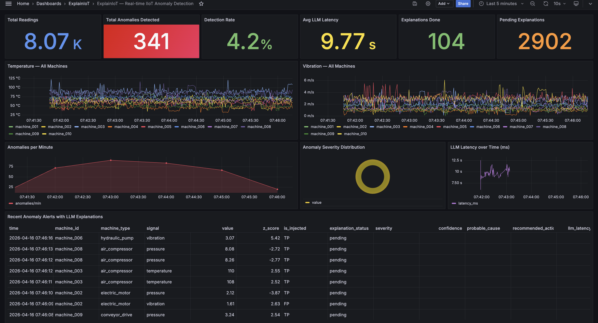

# ExplainIoT — Real-time IIoT Anomaly Detection with LLM Explanations

> **"LLM-Augmented Anomaly Detection for Industrial IoT Sensor Streams: A Real-Time Pipeline Approach"**  
> Submitted to arXiv (cs.LG, eess.SP)

ExplainIoT is a real-time industrial IoT pipeline that detects sensor anomalies and explains them in plain English — telling operators not just *that* something is wrong, but *why*, *how severe*, and *what to do*. It streams data through Apache Kafka (Redpanda), detects anomalies using a sliding-window z-score method, and fires an async LLM call that generates a structured natural language explanation for every alert.



---

## Architecture

```
10 Machines × 3 Signals (temp/pressure/vibration)
        │  1 reading/machine/sec  (30 Hz total)
        ▼
┌─────────────────┐
│ Sensor Generator│  3% anomaly injection · spike / drift / burst
└────────┬────────┘
         │ Kafka (Redpanda)
         ▼
┌─────────────────┐
│ Z-score Detector│  60-reading sliding window · threshold 2.5σ
└────────┬────────┘
         │ anomaly detected
         ├──────────────────────────────────┐
         ▼                                  ▼
┌─────────────────┐              ┌──────────────────────┐
│   TimescaleDB   │◄─────────── │   LLM Explainer      │
│  (hypertables)  │  async fill  │   (Ollama · local)   │
└────────┬────────┘              └──────────────────────┘
         │
         ▼
┌─────────────────┐
│     Grafana     │  live dashboard · auto-provisioned
└─────────────────┘
```

The LLM call is fully asynchronous — it never blocks the 30 Hz detection path. The pipeline maintains throughput while explanations arrive in the background.

---

## Key Results

### Detection Performance

| Metric    | Z-score (ours) | Random baseline |
|-----------|:--------------:|:---------------:|
| Precision | **0.888**      | 0.518           |
| Recall    | 0.079          | 0.046           |
| F1        | 0.144          | 0.084           |

High precision (88.8%) means operator alerts are reliable. Low recall reflects a known z-score limitation on drift-type anomalies — a direction for future work (CUSUM, LSTM).

### LLM Explanation Quality (n=50 human-rated)

| Metric            | Score         |
|-------------------|:-------------:|
| Correctness       | 2.82 ± 1.05 / 5 |
| Actionability     | **3.18 ± 0.71** / 5 |
| Hallucination rate | **8.0 %**    |

### System Latency (end-to-end, anomaly → explanation)

| Percentile | Latency |
|:----------:|:-------:|
| P50        | 10.8 s  |
| P95        | 14.6 s  |
| P99        | 16.3 s  |

Explanation latency is dominated by LLM inference on CPU. The detection path remains unaffected at 30 Hz throughout.

---

## Stack

| Component   | Technology                        |
|-------------|-----------------------------------|
| Streaming   | Redpanda (Kafka-compatible)       |
| Storage     | TimescaleDB (PostgreSQL)          |
| Detection   | Sliding-window z-score (Python)   |
| LLM         | Ollama (local) · llama3.2:1b      |
| Dashboard   | Grafana (auto-provisioned)        |
| Language    | Python 3.12 · asyncio             |

---

## Quickstart

**Prerequisites:** Docker Desktop, Python 3.10+, [Ollama](https://ollama.com)

```bash
# 1. Clone
git clone https://github.com/shravanisaraf/explainiot.git
cd explainiot

# 2. Install Ollama model (one time, ~1.3 GB)
ollama pull llama3.2:1b
brew services start ollama   # macOS

# 3. Install Python deps
pip install -r requirements.txt

# 4. Launch everything
./run.sh
```

Open **http://localhost:3000** (admin / explainiot) for the live Grafana dashboard.

### Evaluation

After ~1 hour of data collection:

```bash
# Rate 50 LLM explanations interactively
python -m eval.rate

# Compute precision/recall/F1 + quality scores + latency percentiles
# Saves figures to eval/figures/ and numbers to eval/metrics.json
python -m eval.metrics
```

---

## Repo Structure

```
src/
  config.py           — machine definitions, all tunable parameters
  sensor_generator.py — 10 machines, 3 fault signatures, ground-truth flags
  producer.py         — Kafka producer
  detector.py         — sliding-window z-score
  explainer.py        — async Ollama client, engineered prompt, JSON output
  consumer.py         — asyncio pipeline: Kafka → detector → DB → LLM
  db.py               — asyncpg pool, TimescaleDB writes

eval/
  rate.py             — interactive explanation rater (Rich TUI)
  metrics.py          — precision/recall/F1, quality scores, latency CDF plots

scripts/init_db.sql   — hypertables, continuous aggregate, ratings table
grafana/              — auto-provisioned dashboard (8 panels)
docker-compose.yml    — Redpanda + TimescaleDB + Grafana
```

---

## Literature Gap

Existing IIoT anomaly detection work splits into two disconnected camps:

1. **Statistical / deep learning detectors** (LSTM autoencoders, Isolation Forest, z-score) — produce binary flags. Operators know something is wrong but not why.
2. **XAI approaches** (SHAP, LIME) — produce numerical feature attributions, not natural language. Require statistical literacy and still don't recommend actions.

Recent LLM-based work (SigLLM, AnomalyLLM, ICLR 2024 benchmark) uses LLMs *for detection*, not explanation — and operates exclusively in batch mode on offline datasets.

**ExplainIoT closes four gaps simultaneously:** detection without explanation → XAI producing numbers not words → LLMs applied to detection not explanation → no streaming integration. A single architecture addresses all four.

---

## Configuration

All parameters are in `.env` (copy from `.env.example`):

```bash
OLLAMA_MODEL=llama3.2:1b     # swap to mistral for higher quality
ZSCORE_THRESHOLD=2.5          # anomaly detection sensitivity
WINDOW_SIZE=60                # sliding window length (readings)
ANOMALY_RATE=0.03             # injection rate for simulation
RANDOM_SEED=42                # reproducibility
```
